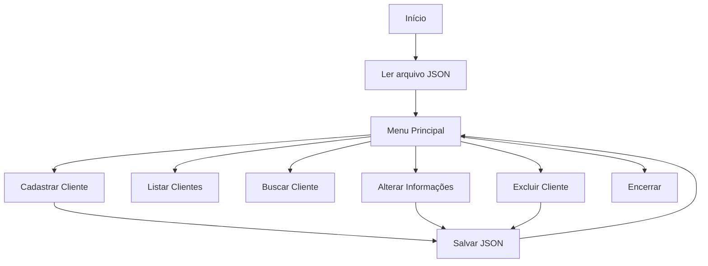

# Sistema-simples-de-cadastro-em-Python
# 🗂️ Sistema de Cadastro de Clientes

Um sistema de cadastro de clientes desenvolvido em **Python**, utilizando **JSON** para persistência de dados. O projeto foi criado com o objetivo de praticar os principais conceitos da linguagem por meio da implementação de um sistema CRUD (Create, Read, Update e Delete).

---

# 📖 Sobre o projeto

Este sistema permite gerenciar o cadastro de clientes diretamente pelo terminal. As informações cadastradas são armazenadas em um arquivo JSON, garantindo que os dados permaneçam salvos mesmo após o encerramento do programa.

Durante o desenvolvimento foram aplicados conceitos como:

- Funções
- Estruturas de repetição
- Estruturas condicionais
- Dicionários
- Manipulação de arquivos
- Persistência de dados em JSON
- Tratamento de exceções (`try` e `except`)
- Organização do código em módulos

---

# ✨ Funcionalidades

✔ Cadastro de novos clientes

✔ Geração automática do número de cadastro

✔ Listagem dos clientes

- Mais antigos primeiro
- Mais recentes primeiro

✔ Busca de clientes pelo número de cadastro

✔ Alteração de informações

✔ Exclusão de clientes

✔ Salvamento automático das alterações

---

# 🛠 Tecnologias utilizadas

- Python 3
- JSON
- Dicionários
- Manipulação de arquivos
- Programação estruturada

---

# 📂 Estrutura do projeto

```text
Sistema-de-Cadastro/
│
├── Meu sistema de cadastro.py      # Programa principal
├── cadastrados_json.py             # Persistência de dados
├── cadastrados.json                # Banco de dados em JSON
└── README.md
```

---

# ⚙ Como executar

### 1. Clone o repositório

```bash
git clone https://github.com/seu-usuario/Sistema-de-Cadastro.git
```

### 2. Acesse a pasta

```bash
cd Sistema-de-Cadastro
```

### 3. Execute o programa

```bash
python sistema.py
```

---

# 🖥 Menu do sistema

```
---------- SISTEMA DE CADASTRO ----------

1 - Cadastrar novo cliente

2 - Listar clientes

3 - Buscar cliente

4 - Alterar informações

5 - Excluir cliente

6 - Sair
```

---

# 🔄 Fluxo do sistema



---

# 📦 Estrutura dos dados

Os clientes são armazenados no seguinte formato:

```json
{
    "600": {
        "Nome": "João",
        "Idade": 25,
        "Telefone": "(31)99999-9999",
        "Email": "joao@email.com",
        "Cadastro": 600
    }
}
```

---

# 📚 Estrutura do código

## Arquivo principal

Responsável por:

- Exibir o menu
- Receber as entradas do usuário
- Executar as funcionalidades
- Salvar as alterações

---

## Módulo de persistência

### `ler_clientes()`

Responsável por carregar os dados do arquivo JSON.

Caso o arquivo ainda não exista, retorna uma coleção vazia.

---

### `cadastrar_clientes(lista_de_clientes)`

Recebe o dicionário atualizado e grava todas as informações no arquivo `cadastrados.json`.

---

### `printar_informacoes()`

Exibe todas as informações de um cliente de forma organizada.

---

# 💡 Conceitos praticados

- Organização em módulos
- Manipulação de arquivos JSON
- Dicionários aninhados
- Estruturas de repetição
- Estruturas condicionais
- Funções
- Tratamento de exceções
- CRUD completo
- Persistência de dados

---

# 🚀 Melhorias futuras

- [ ] Buscar clientes pelo nome
- [ ] Buscar pelo telefone
- [ ] Validação de e-mail
- [ ] Validação de telefone
- [ ] Validação da idade
- [ ] Interface gráfica com Tkinter
- [ ] Banco de dados SQLite
- [ ] Sistema de login
- [ ] Cadastro por CPF
- [ ] Exportação para Excel
- [ ] Relatórios de clientes
- [ ] Programação Orientada a Objetos

---

# 📈 Roadmap

| Etapa | Status |
|--------|--------|
| Cadastro de clientes | ✅ |
| Listagem | ✅ |
| Busca | ✅ |
| Alteração | ✅ |
| Exclusão | ✅ |
| Persistência em JSON | ✅ |
| Interface gráfica | 🔄 |
| Banco de dados | 🔄 |

---

# 🎯 Objetivo do projeto

Este projeto foi desenvolvido para consolidar os conhecimentos em Python por meio da implementação de um sistema CRUD completo, simulando uma aplicação utilizada no mercado para gerenciamento de cadastros.

---

# 👩‍💻 Autora

**Fabrine Silva Evangelista**

Estudante de programação e desenvolvimento de software.

---

## ⭐ Se este projeto foi útil para você, deixe uma estrela no repositório!